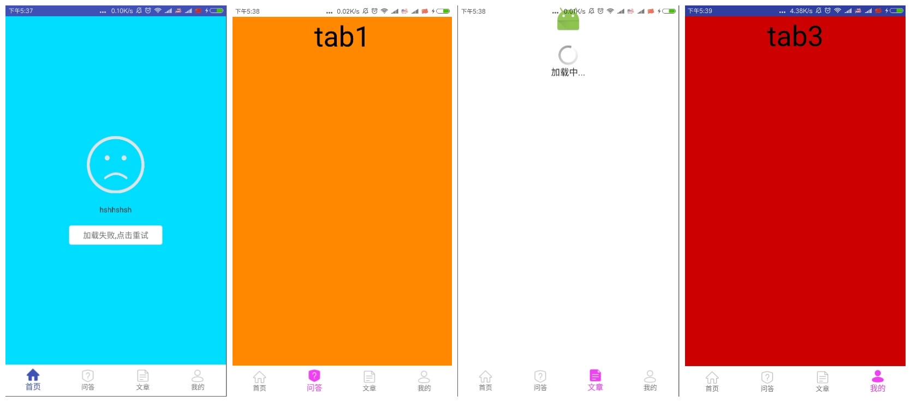

# MainActivityUIUtil
](https://jitpack.io/#hss01248/MainActivityUIUtil)

底部tab+viewpager+状态栏变色/字体变色兼容,

viewpager的各页面建立了BaseMainPage,

实现了数据的懒加载,以及各page的生命周期控制.


statusBarUtil:可单独拷贝出来使用

沉浸式和非沉浸式状态栏,变色以及背景为白色时状态栏字体变色,多tab切换时状态栏变色的综合解决方案

# 效果图:

 

# 使用


```
MainUIUtil.getInstance(this);

mainUIUtil.addInfos(baseMainPages,statusbarConfigBeans,tabItemBeans);

```

自定义的配置放在baseMainPages,statusbarConfigBeans,tabItemBeans三个list中,具体请看demo.

## gradle

**Step 1.** Add the JitPack repository to your build file

Add it in your root build.gradle at the end of repositories:

```
    allprojects {
        repositories {
            ...
            maven { url "https://jitpack.io" }
        }
    }
```

**Step 2.** Add the dependency

```
    dependencies {
            compile 'com.github.hss01248:MainActivityUIUtil:1.0.0'
    }
```


# 感谢

[PagerBottomTabStrip](https://github.com/tyzlmjj/PagerBottomTabStrip)